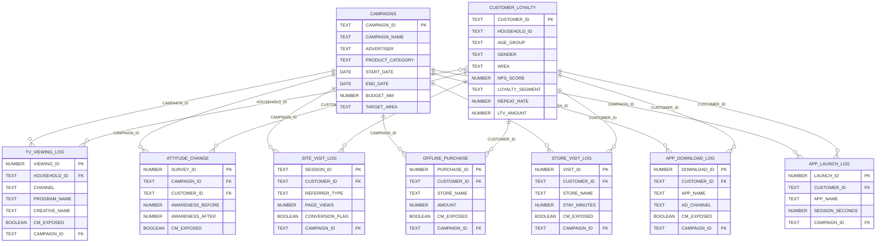

# STADIA360 Snowflake デモ基盤

電通の統合マーケティングプラットフォーム **STADIA360** のデータを Snowflake 上に構築し、**Streamlit in Snowflake (SiS)** によるダッシュボード可視化と **Snowflake Intelligence (Cortex Agent)** によるAI分析を実現するデモプロジェクトです。

## 概要

STADIA360 は、テレビCM接触から態度変容、サイト来訪、購買、来店、アプリ利用まで、消費者行動をキャンペーン単位で横断的に追跡・分析する統合マーケティング基盤です。本リポジトリでは、そのデータモデルをSnowflake上に再現し、2つのインターフェースで分析できる環境を提供します。

## アーキテクチャ

```
┌─────────────────────────────────────────────────────────┐
│                    Snowflake Account                     │
│                                                          │
│  ┌──────────────┐   ┌─────────────────────────────────┐ │
│  │  9 Data      │   │  Semantic View                  │ │
│  │  Tables      │──▶│  STADIA360_ANALYTICS            │ │
│  │  (Dummy Data)│   │  (42 dims / 18 facts / 25 metrics)│
│  └──────┬───────┘   └──────────┬──────────────────────┘ │
│         │                      │                         │
│         │          ┌───────────┴───────────┐             │
│         │          │                       │             │
│  ┌──────▼──────────▼────────┐   ┌──────────▼──────────┐ │
│  │ Streamlit in Snowflake   │   │ Cortex Agent         │ │
│  │ ┌─────────┐ ┌──────────┐│   │ (Snowflake           │ │
│  │ │Dashboard│ │AI問い合わせ││   │  Intelligence)       │ │
│  │ │ (Altair)│ │(COMPLETE)││   │ + data_to_chart      │ │
│  │ └─────────┘ └──────────┘│   └─────────────────────┘ │
│  └─────────────────────────┘                             │
└─────────────────────────────────────────────────────────┘
```

## ファイル構成

| ファイル | 説明 |
|---|---|
| `stadia360_setup.sql` | テーブル作成、ダミーデータ投入、Semantic View 定義の SQL |
| `stadia360_dashboard_sis.py` | Streamlit in Snowflake 用ダッシュボードアプリ |
| `stadia360_agent_spec.json` | Cortex Agent の仕様定義（参考用） |

## データモデル

### テーブル一覧

| テーブル | 行数 | 説明 |
|---|---:|---|
| **CAMPAIGNS** | 8 | キャンペーンマスタ。全テーブルの中心となるハブテーブル |
| **TV_VIEWING_LOG** | 5,000 | テレビ実視聴ログ。CM接触有無、チャンネル、番組、CM素材名、視聴秒数 |
| **CUSTOMER_LOYALTY** | 1,000 | 顧客ロイヤリティ。NPS、LTV、リピート率、セグメント |
| **ATTITUDE_CHANGE** | 500 | 態度変容調査。認知/興味/検討/購入意向の Before/After |
| **SITE_VISIT_LOG** | 5,000 | サイト来訪ログ。流入経路、PV数、滞在時間、CV有無 |
| **OFFLINE_PURCHASE** | 3,000 | オフライン購買。店舗名、商品、金額、CM接触有無 |
| **STORE_VISIT_LOG** | 2,000 | 来店ログ。店舗、滞在時間、位置情報 |
| **APP_DOWNLOAD_LOG** | 1,000 | アプリDLログ。アプリ名、OS、広告チャネル |
| **APP_LAUNCH_LOG** | 3,000 | アプリ起動ログ。セッション時間、利用機能 |

### ER図（データ関係図）



### リレーションシップの設計

**スター型スキーマ** で、2つのハブテーブルを中心に全データが紐づきます。

- **`CAMPAIGNS`** (キャンペーン軸) — `CAMPAIGN_ID` で7つの行動ログテーブルと結合。キャンペーン単位の横断分析を実現
- **`CUSTOMER_LOYALTY`** (顧客軸) — `CUSTOMER_ID` で6つの行動ログテーブルと結合。顧客単位のジャーニー分析を実現
- **`TV_VIEWING_LOG`** は `HOUSEHOLD_ID`（世帯ID）で `CUSTOMER_LOYALTY` と結合。テレビ視聴は世帯単位での計測のため

全行動ログテーブルに共通の **`CM_EXPOSED`** フラグがあり、CM接触者 vs 非接触者の比較分析（リフト分析）が全チャネルで可能です。

## セットアップ手順

### 前提条件

- Snowflake アカウント（ACCOUNTADMIN ロール推奨）
- ウェアハウス（例: `COMPUTE_WH`）
- [Snow CLI](https://docs.snowflake.com/en/developer-guide/snowflake-cli/index) がインストール済み

### 1. データベース・スキーマ・テーブルの作成とデータ投入

`stadia360_setup.sql` を Snowflake 上で実行します。このSQLファイルには以下が含まれます:

- データベース `KFUKAMORI_GEN_DB` とスキーマ `STADIA360` の作成
- 9テーブルの DDL
- `GENERATOR` を使ったダミーデータの INSERT（合計 20,500行）
- Semantic View `STADIA360_ANALYTICS` の作成

```sql
-- Snowsight の SQL Worksheet で実行するか、Snow CLI で実行
-- ※ データベース名・スキーマ名は環境に合わせて変更してください
```

> **注意**: `stadia360_setup.sql` 内のデータベース名 `KFUKAMORI_GEN_DB` やスキーマ名 `STADIA360` は、ご自身の環境に合わせて適宜変更してください。

### 2. Streamlit in Snowflake (SiS) のデプロイ

```bash
# ステージの作成（setup.sql に含まれていない場合）
snow sql -q "CREATE STAGE IF NOT EXISTS KFUKAMORI_GEN_DB.STADIA360.STADIA360_STAGE
  DIRECTORY = (ENABLE = TRUE)
  ENCRYPTION = (TYPE = 'SNOWFLAKE_SSE')" -c <connection_name>

# ダッシュボードファイルのアップロード
snow stage copy stadia360_dashboard_sis.py \
  @KFUKAMORI_GEN_DB.STADIA360.STADIA360_STAGE/ \
  --overwrite -c <connection_name>

# Streamlit アプリの作成
snow sql -q "CREATE OR REPLACE STREAMLIT KFUKAMORI_GEN_DB.STADIA360.STADIA360_DASHBOARD
  ROOT_LOCATION = '@KFUKAMORI_GEN_DB.STADIA360.STADIA360_STAGE'
  MAIN_FILE = 'stadia360_dashboard_sis.py'
  QUERY_WAREHOUSE = 'COMPUTE_WH'
  TITLE = 'STADIA360 マーケティング分析ダッシュボード'" -c <connection_name>
```

### 3. Cortex Agent (Snowflake Intelligence) のデプロイ

```sql
CREATE OR REPLACE AGENT KFUKAMORI_GEN_DB.STADIA360.STADIA360_AGENT
  COMMENT = 'STADIA360統合マーケティング基盤のAI分析エージェント'
  FROM SPECIFICATION
  $$
  models:
    orchestration: auto

  instructions:
    orchestration: "あなたは電通のSTADIA360統合マーケティング基盤のデータ分析スペシャリストです。テレビ実視聴ログ、顧客ロイヤリティ、態度変容、サイト来訪、オフライン購買、来店、アプリDL/起動のデータを横断的に分析し、広告効果の検証やマーケティングインサイトの提供を行います。"
    response: "回答は日本語で行ってください。金額は円単位、割合は小数点第1位まで表示してください。分析結果にはビジネス上の示唆も添えてください。"
    sample_questions:
      - question: "CM接触者と非接触者でオフライン購買金額にどのくらい差がありますか？"
      - question: "チャンネル別のCM接触率を教えてください"
      - question: "態度変容のファネル分析（認知→購入意向）を見せてください"

  tools:
    - tool_spec:
        type: "cortex_analyst_text_to_sql"
        name: "stadia360_analytics"
        description: "STADIA360統合マーケティング基盤のデータを分析するツール"
    - tool_spec:
        type: "data_to_chart"
        name: "data_to_chart"
        description: "分析結果をチャートで可視化するツール"

  tool_resources:
    stadia360_analytics:
      semantic_view: "KFUKAMORI_GEN_DB.STADIA360.STADIA360_ANALYTICS"
      execution_environment:
        type: "warehouse"
        warehouse: "COMPUTE_WH"
  $$;
```

## Streamlit in Snowflake (SiS) でできること

アプリは **2つのタブ** で構成されています。

### ダッシュボードタブ

8つのセクションで構成され、STADIA360のデータを多角的に可視化します。

| セクション | 主な可視化 |
|---|---|
| **KPI サマリー** | CM接触率、サイトCVR、購買総額、平均NPS など8指標 |
| **テレビ視聴分析** | チャンネル別CM接触率、時間帯別視聴パターン、TV vs CTV デバイス比較 |
| **CM効果分析（レスポンス分析）** | 放送局別ドリル、クリエイティブドリル、レスポンスヒートマップ、番組ランキング、リーセンシー分析 |
| **態度変容ファネル** | CM接触者 vs 非接触者のリフト比較（認知→興味→検討→購入）、キャンペーン別認知リフト |
| **サイト来訪分析** | 流入経路別セッション数・CVR、月別推移 |
| **オフライン購買分析** | CM接触者/非接触者の購買金額比較、商品カテゴリ別売上 |
| **来店・アプリ分析** | 店舗別来店件数、アプリ別DL数・起動数、DLチャネル・OS分布 |
| **顧客ロイヤリティ分析** | ロイヤリティセグメント分布、年齢層×性別分布、エリア別NPS/LTV |

### AI問い合わせタブ

`SNOWFLAKE.CORTEX.COMPLETE` (claude-3-5-sonnet) を使った自然言語問い合わせ機能です。

- フィルタ適用済みの全テーブルデータをサマリー化してプロンプトに埋め込み
- `session.sql()` 経由で `CORTEX.COMPLETE` を呼び出し（REST API 不要、SiS warehouse ランタイムで動作）
- サンプル質問ボタンによるワンクリック問い合わせ
- チャット履歴の保持

### 機能

- **サイドバーフィルター**: キャンペーン選択、エリア選択によるインタラクティブな絞り込み
- **Altair チャート**: 棒グラフ、円グラフ、ファセットチャートによる多角的な可視化
- **キャッシュ**: `st.cache_data` によるクエリ結果のキャッシュで高速表示
- **SiS ネイティブ**: `get_active_session()` パターンにより Snowflake 内で直接実行

## Snowflake Intelligence (Cortex Agent) でできること

Cortex Agent により、Snowflake Intelligence の画面から日本語の自然言語でデータに質問できます。

### 質問例

- 「CM接触者と非接触者でオフライン購買金額にどのくらい差がありますか？」
- 「チャンネル別のCM接触率を教えてください」
- 「キャンペーン別の認知リフトはどうなっていますか？」
- 「サイト来訪の流入経路別コンバージョン率を分析してください」
- 「アプリDL数が最も多い広告チャネルは？」
- 「30代女性のNPSスコアの平均は？」

### 仕組み

1. ユーザーが日本語で質問を入力
2. Cortex Agent が **Semantic View** (`STADIA360_ANALYTICS`) を参照して質問を SQL に変換
3. 自動生成された SQL を実行し、結果を日本語で回答
4. 必要に応じて **data_to_chart** ツールでチャートも自動生成

### Semantic View の構成

| 要素 | 数 | 説明 |
|---|---:|---|
| 論理テーブル | 9 | 全データテーブルをカバー |
| リレーションシップ | 13 | テーブル間の結合条件を定義 |
| ディメンション | 42 | 分析軸（カテゴリ、エリア、日付など） |
| ファクト | 18 | 数値項目（金額、秒数、スコアなど） |
| メトリクス | 25 | 事前定義の集計指標（平均購買額、CVR など） |

## 技術的なポイント

### Semantic View の構文

Snowflake の Semantic View DDL では、セクションの記述順序が重要です。**FACTS を DIMENSIONS より前に記述する** 必要があります。

```sql
CREATE OR REPLACE SEMANTIC VIEW ...
  TABLES (...)
  RELATIONSHIPS (...)
  FACTS (...)        -- ← DIMENSIONS より前
  DIMENSIONS (...)
  METRICS (...);
```

### Cortex Agent の DDL 構文

Cortex Agent は `CREATE AGENT ... FROM SPECIFICATION $$ YAML $$` 構文を使用します（`CREATE CORTEX AGENT` ではありません）。

```sql
CREATE OR REPLACE AGENT <name>
  COMMENT = '...'
  FROM SPECIFICATION
  $$
  models:
    orchestration: auto
  instructions:
    orchestration: "..."
  tools:
    - tool_spec:
        type: "cortex_analyst_text_to_sql"
        name: "..."
  tool_resources:
    <tool_name>:
      semantic_view: "DB.SCHEMA.VIEW_NAME"
  $$;
```

### SiS での Altair バージョン

Streamlit in Snowflake 環境では **Altair v4** が使用されます。v5 で導入された `xOffset` エンコーディングは使用できないため、グループ化棒グラフには `column`（ファセット）エンコーディングを使用します。

### SiS での Cortex COMPLETE 利用

SiS 環境では Cortex Agent REST API は直接呼び出せませんが、`SNOWFLAKE.CORTEX.COMPLETE` は `session.sql()` 経由で利用可能です。

```python
result = session.sql(
    "SELECT SNOWFLAKE.CORTEX.COMPLETE('claude-3-5-sonnet', '...') AS RESPONSE"
).collect()
```

### SiS での Boolean 型の扱い

Snowflake の `BOOLEAN` カラムは SiS の Pandas 環境で `object` 型として返される場合があります。数値演算（`.sum()`, `.round()` 等）を行う前に `pd.to_numeric()` で変換が必要です。

```python
df["CONVERSION_FLAG"] = pd.to_numeric(df["CONVERSION_FLAG"], errors="coerce").fillna(0).astype(int)
```

### SiS での Streamlit API 制限

SiS 環境の Streamlit バージョンでは `st.chat_input` / `st.chat_message` が利用できません。チャット UI は `st.text_input` + `st.button` + `st.markdown` で代替実装しています。

### ダミーデータ生成

Snowflake の `GENERATOR` 関数を使用して大量のダミーデータを効率的に生成しています。

```sql
INSERT INTO table_name
SELECT ...
FROM TABLE(GENERATOR(ROWCOUNT => 5000));
```

## 分析ユースケース

| 分析テーマ | 使用テーブル | 結合キー |
|---|---|---|
| CM接触 → 態度変容リフト | CAMPAIGNS + ATTITUDE_CHANGE | CAMPAIGN_ID |
| CM接触 → 購買リフト | CAMPAIGNS + OFFLINE_PURCHASE | CAMPAIGN_ID |
| 顧客ジャーニー全体 | CUSTOMER_LOYALTY + 全行動ログ | CUSTOMER_ID |
| チャネル横断 ROI | CAMPAIGNS + 全行動ログ | CAMPAIGN_ID |
| テレビ視聴 → サイト来訪 | TV_VIEWING_LOG + SITE_VISIT_LOG | HOUSEHOLD_ID/CUSTOMER_ID 経由 |
| ロイヤリティ × 購買行動 | CUSTOMER_LOYALTY + OFFLINE_PURCHASE | CUSTOMER_ID |
| アプリ利用 × CM接触 | APP_DOWNLOAD_LOG + APP_LAUNCH_LOG | CUSTOMER_ID, APP_NAME |

## ライセンス

このリポジトリはデモ目的で作成されたものです。
